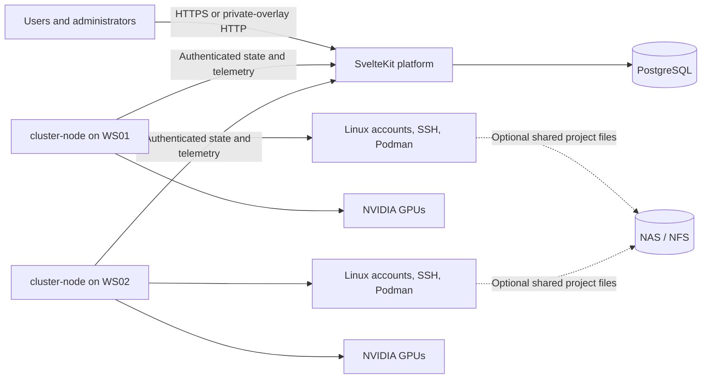

# Cluster Manager

Cluster Manager is a small, self-hosted platform for operating shared Debian and Ubuntu GPU
workstations in a research lab. It combines a central web application with a
privileged node service on each workstation.

The platform manages users, workstation access, GPU reservations, monitoring, and
auditing. Users keep local Linux accounts and connect directly over SSH; the node
reconciles those accounts and reports host and NVIDIA telemetry.

## Features

- Central user, role, workstation, and access management
- Independent assignment of one user to multiple workstations
- Shared platform and Linux password authentication without plaintext storage
- Consistent platform-assigned UID/GID values for optional shared NFS storage
- Collision-safe Linux account, private-group, home, SSH, and rootless Podman setup
- Workstation health, storage, session, GPU, and process monitoring
- Per-GPU reservations with conflict detection and privacy-aware user views
- User stop requests and narrowly scoped, administrator-approved process termination
- Audited privileged actions, node enrollment, credential rotation, and revocation
- Release-backed `cluster-node` installation, diagnostics, upgrades, and safe uninstall
- Docker Compose development environment with two simulated GPU workstations

## Architecture



The platform is the source of truth. Nodes pull authenticated desired state and
report observed state; they do not expose a generic remote-command interface.

## Quick start

Requirements: Docker with Docker Compose. HTTPS is the production default; explicitly
allowed HTTP is supported when access stays inside an encrypted private overlay.

```bash
git clone https://github.com/Joshimello/cluster-manager.git
cd cluster-manager
cp .env.production.example .env
chmod 600 .env
${EDITOR:-vi} .env
docker compose pull
docker compose up -d --wait
```

The Compose file pulls the prebuilt multi-architecture platform image from GitHub
Container Registry and starts it with PostgreSQL. Configure the documented HTTPS
reverse proxy, or set `ALLOW_HTTP=true` and bind specifically to a trusted private
overlay address. Then create the initial administrator:

```bash
docker compose exec platform \
  npm run admin:bootstrap -- --username admin --display-name "Lab Administrator"
```

The command prints a one-time temporary password. Sign in and replace it when
prompted. For source-mounted development with simulated workstations, use the
[development guide](docs/development.md).

To install a real Debian or Ubuntu node from the latest verified release:

```bash
curl -fsSL https://raw.githubusercontent.com/Joshimello/cluster-manager/main/install-node.sh | sudo bash
```

## Documentation

- [Development guide](docs/development.md)
- [Node installation and lifecycle](docs/node-installation.md)
- [Manual node installation](docs/node-installation-manual.md)
- [Production operations](docs/operations.md)
- [Security review](docs/security-review.md)
- [Latest release](https://github.com/Joshimello/cluster-manager/releases/latest)
